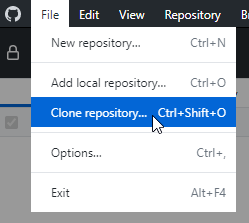
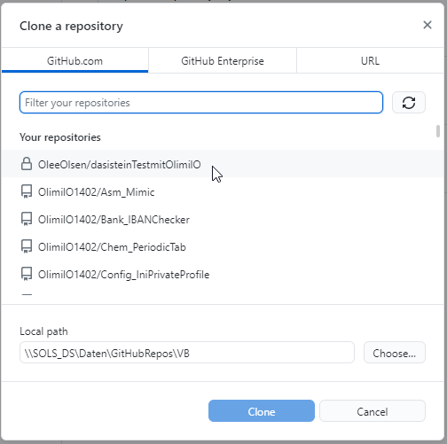
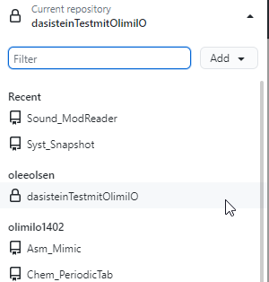

# GitHub_TwoContribs
## Two contributors working together using GitHub-Desktop   
### This is a tutorial answering the question:
How to work together with another contributor in a private repository, using GitHub-Desktop
Project started 30. july 2021 

German language:  
================
  
User_1: der User der in seinem Account ein Repo anlegt und eine Anderen einlädt  
User_2: der User der von User_1 eingeladen wird  
  
User_1:
-------
* In GitHub lege ein Repository an oder gehe zu einem existierenden Repo. 
* Im GitHub-Ordner für das Repo gehe ins Menü "Settings"->"Manage access"
* Der Einzuladende User muss einen GitHub-Account haben.
* Der Name muss bekannt sein, dann muss nur der Name eingegeben werden, und GitHub findet den User.

User_2:
-------
* User_2 sollte in seinen Emails (könnte ca 2 Std dauern) eine Einladung finden in etwa wie in folgendem Bild  

* beim Klick auf den Link in der Email (oder Link kopieren und in die Adresszeile eines Browsers einfügen) gelangt man zu folgender Seite in GitHub  

* in GitHub-Desktop muss man jetzt das Repository kopieren bzw Clonen dazu im Menü "File"->"Clone repository..."  

* Ordner auswählen  

* das neue Repository ist jetzt in der Repo-liste zu finden  

